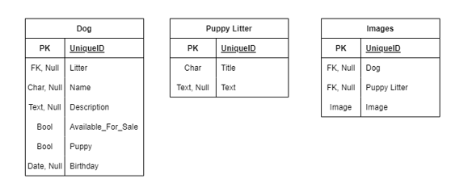
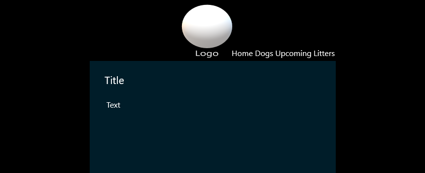

# WolfCreekKennel
Website for providing customers information about the Wolf Creek Kennel and its available puppies.

## Details

### Users can do the following.
*Get general information on the Wolf Creek Kennel.
*See the dogs at the kennel.
*Get information on upcoming litters.
*Contact the owners of the kennel through a "Contact Us" form.

### Web admins can do the following.
*Update the general information about Wolf Creek Kennel through an admin panel.
*Add, delete, and edit information about the dogs at the kennel through an admin panel.
*Upload images of upcoming litters and post information about these puppies through an admin panel.
*Recieve emails when a user fills out the "Contact Us" form.
*Web admins can update all aspects of text and images on the site through a convenient admin panel, never needing to get into the code.*

## Technologies
1.Django
2.Django Rest Framework
3.Vue.js
4.Tailwind
5.GreenSock

## Languages
1.Python
2.JavaScript
3.HTML / CSS

## Data Models

## Theme and Design
*Below is an example of the overall theme of the website's design.*

## Pages
*Home - general information about the kennel and contact us form
*Dogs - information about dogs in the kennel
*Upcoming Litters - information about puppies that will soon be available

## Schedule
*Dec 9 - HTML, Models, User system built
*Dec 14 - Tailwind and CSS built
*Dec 21 - GreenSock animations built
*Dec 23 - Project finalized
